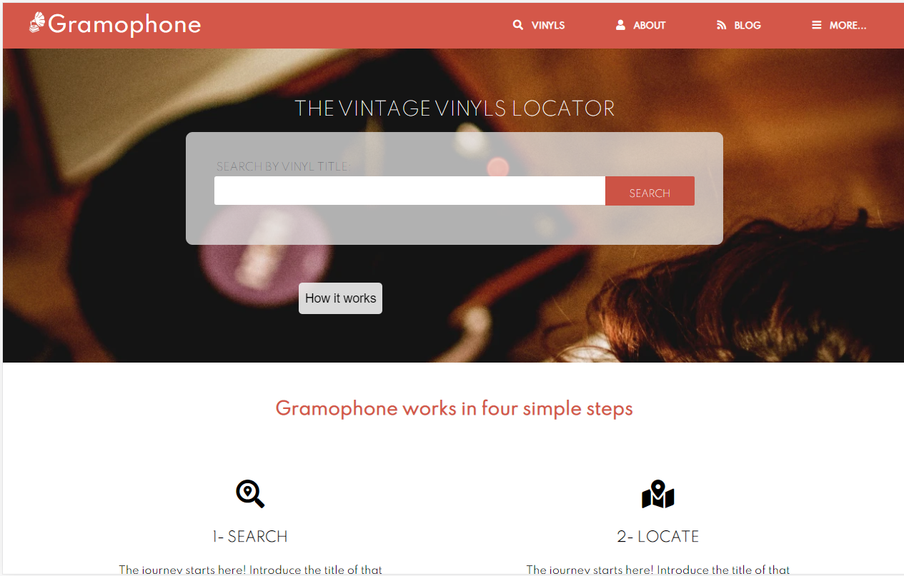

# CSS Capstone Project

> In this project I've build up a responsive website with 3 pages based on screenshots of the design.

With a given design I build a responsive website with 3 pages. This project is a model for a database of record vinyls for collectionist. I took special care of the mobile version, using big buttons and a big enough font size so it looks like a proper mobile app instead of a reduce verion of a website.

## Built With

- HTML5
- Bootstrap 4

## Live Demo

[Live Demo Link](https://raw.githack.com/Daniduran-dev/capstone-css/feature/index.html)

## Authors

👤 **Daniel Duran**

- Github: [@Daniduran-dev](https://github.com/Daniduran-dev)

## 🤝 Contributing

Contributions, issues and feature requests are welcome!

Feel free to check the [issues page](issues/).

## Show your support

Give a ⭐️ if you like this project!

## Acknowledgments

- Microverse
- Stack Overflow

## 📝 License

This project is [MIT](lic.url) licensed.
